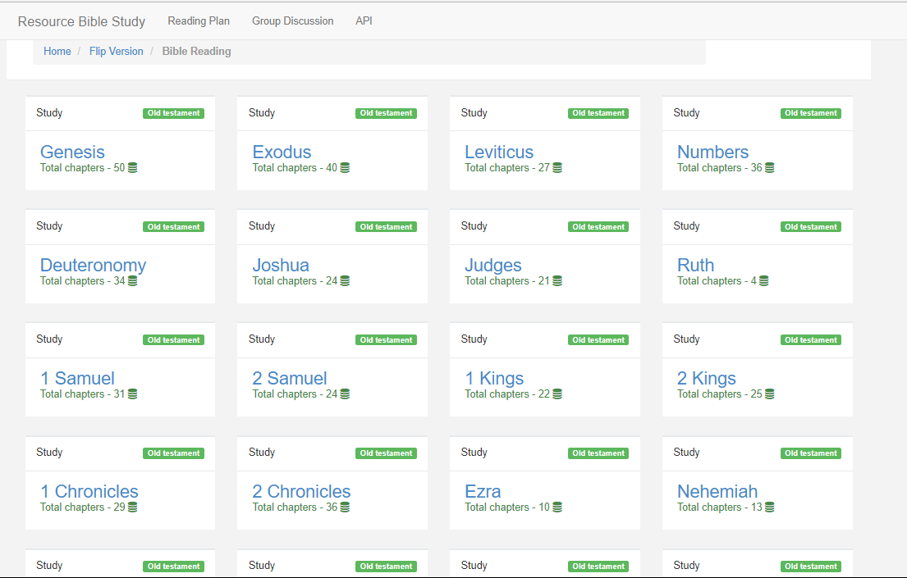
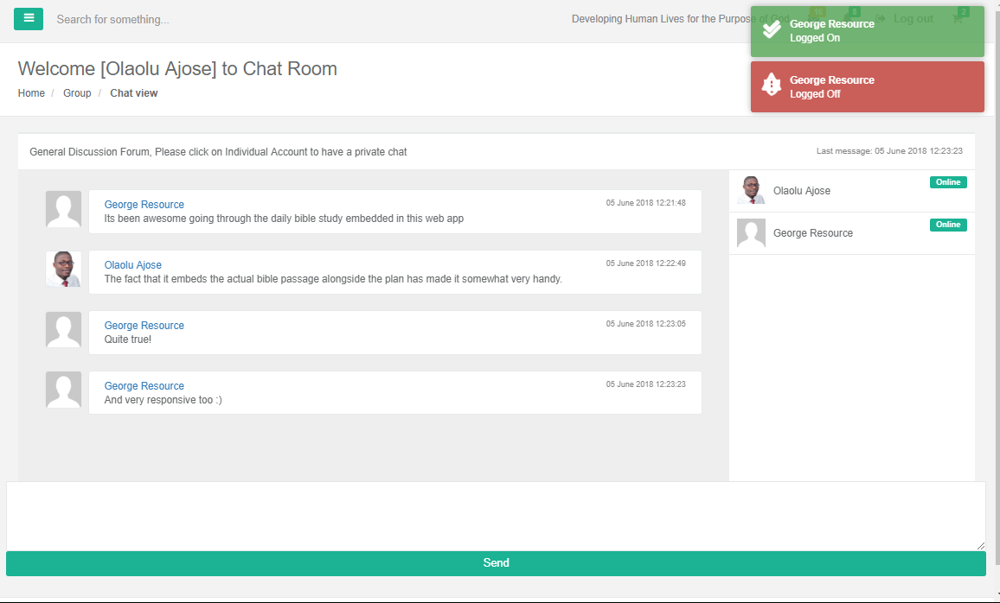
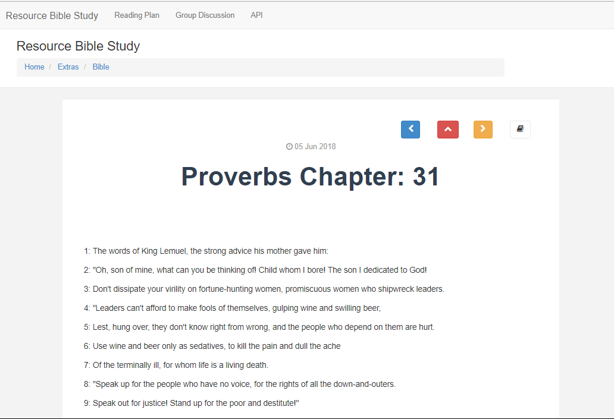

# Resource Bible Study
Open Source Multi Version - Bible Study

## Features
* Bible Yearly Reading Plan
* Group Discussion Forum
* Animated Bible View.
* Web API

### Screenshots

![Bible Animated](screenshots/Bible Study Animated.PNG

# Contributes
* Honza -  Bible Files
* Tunjs - Animated Book View
* SignalR - Discussion Forum
* Theme - BootStrap - FontAwesome
* Reading Plan - Resource Centre Int

# To Do
* Text to speech.
* Optimize Search both Web and API
* Multi-version
